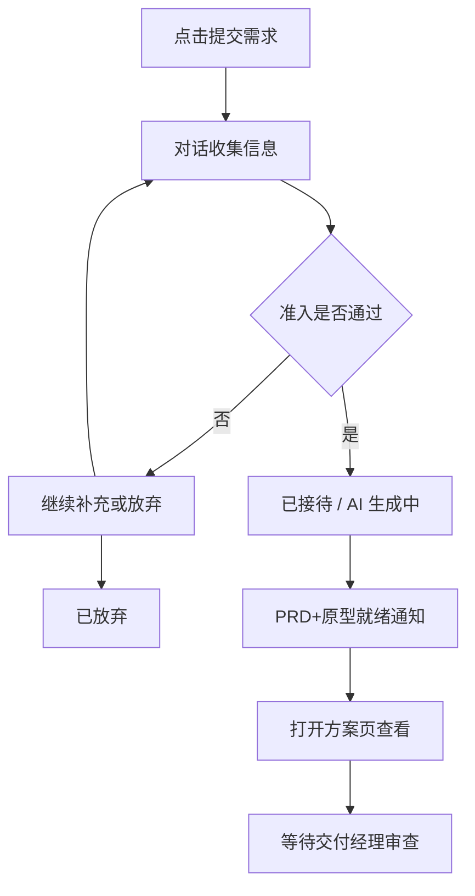
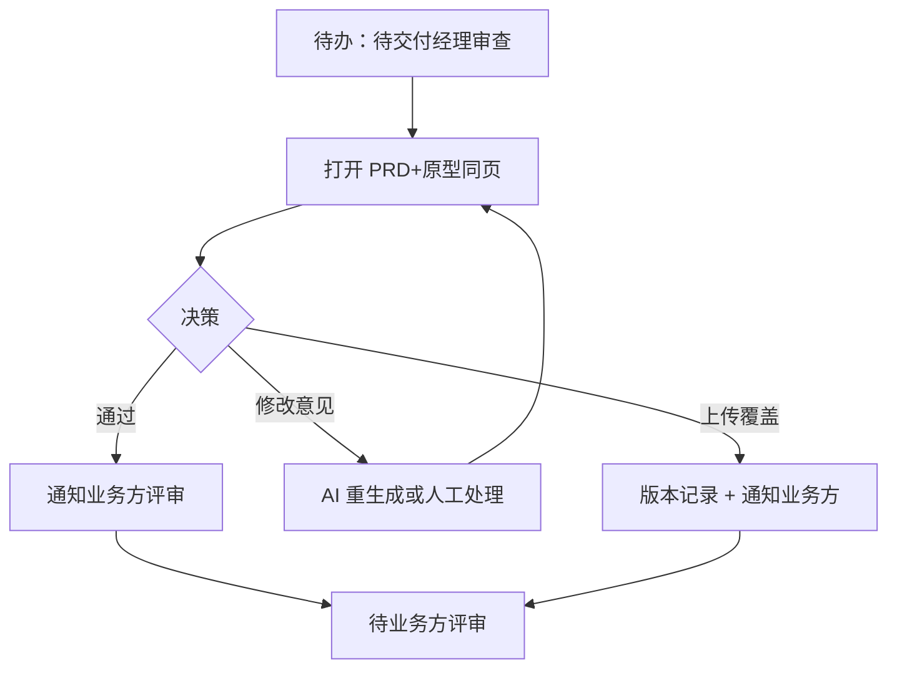
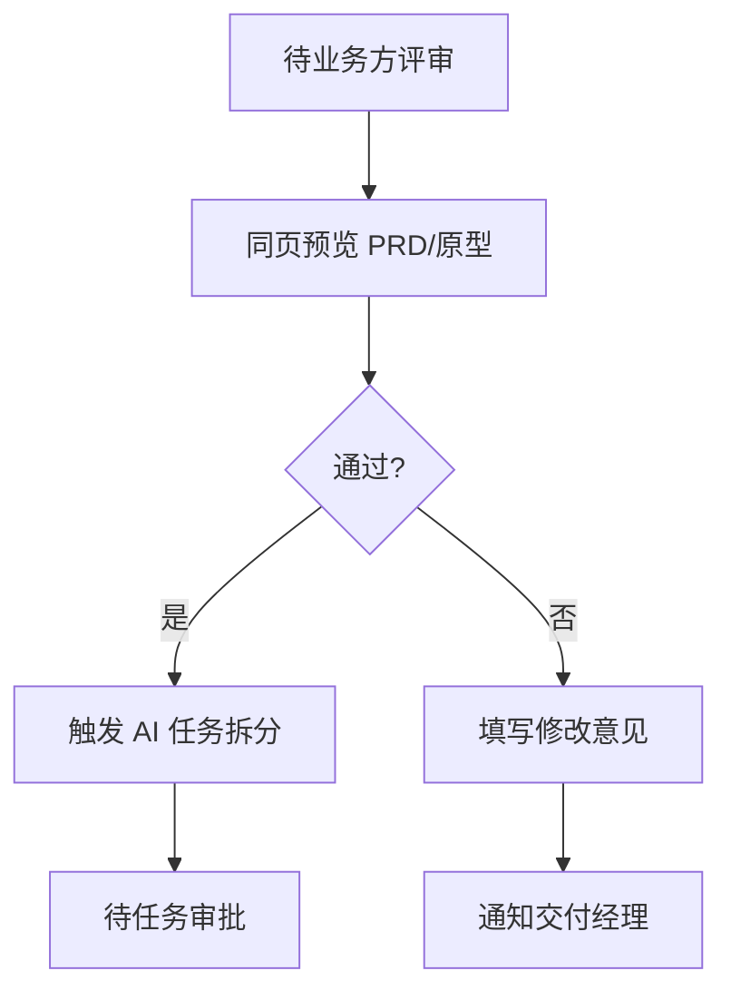

---

## stepsCompleted: [1, 2, 3, 4, 5, 6, 7, 8, 9, 10, 11, 12, 13, 14]

lastStep: 14
completedAt: '2026-04-07'
inputDocuments: []

# UX Design Specification 需求全流程管理系统

**Author:** Peng
**Date:** 2026-03-07

---

## Executive Summary

### Project Vision

打造一个以 AI 为核心的需求全流程闭环交付系统：从"对话式提交需求"开始，自动生成需求设计方案与交付拆解，并通过双轨审批与企业微信通知完成对齐与管控，最终推动验收交付并沉淀复盘资产，提升交付团队从协作走向"超级个体/端到端交付负责人"的能力。

### Target Users

1. 交付团队的核心成员：产品经理、开发、测试等希望提升为"超级个体"的角色，需要在更短时间内把业务想法沉淀为可执行、可验收的交付成果。
2. 协同与治理角色：业务/需求方（提供需求输入与反馈）、需求交付经理（对齐与把关）、管理员（流程配置、权限与审计）。

### Key Design Challenges

1. 从"跟进式管理"到"AI 端到端交付"的体验跃迁：确保用户在新模式下仍能快速理解、信任并持续推进（从提交到方案、从方案到审批、从审批到任务执行）。
2. 双轨审批与质量对齐的 UX 设计：在保证业务一致性的同时，避免审批流程变成阻塞与返工的来源。
3. 会议场景下的高效闭环：支持"业务开会中即时提出想法"，并在合理时延内生成可评审的设计方案与后续可拆分交付物。

### Design Opportunities

1. AI 自动生成"需求设计方案 + 可审批产物"：把用户的输入直接转化为能进入审批与执行的结构化结果，从而缩短从想法到交付的路径。
2. 双轨审批的可视化与可追溯：让审批决策、修改原因、最终版本与验收链路一目了然，提高质量与复盘效率。
3. 微信触达驱动协同闭环：把通知与关键节点对齐到企业微信场景，减少跨系统沟通成本，让用户能在工作流中持续推进。

## Core User Experience

### Defining Experience

本系统的核心体验是"提交需求 → AI 自动生成设计方案 → 审批评审 → 推进交付"的端到端闭环。用户最频繁的动作是提交需求与审查 AI 生成的产品设计方案（PRD + 原型 DEMO）；最关键的单一交互是：用户通过系统提交需求并完成需求评审，这个环节如果流畅，整个产品体验就立住了。

绝对不能出错的是"需求记录"与"需求当前状态"——这是所有角色信任系统的基础。AI 生成的方案可以随模型与提示词持续优化，但需求数据与状态一旦出错，整个流程的可追溯性将崩塌。

### Platform Strategy

| 维度   | 策略                                                        |
| ---- | --------------------------------------------------------- |
| 主平台  | Web 应用（PC 浏览器），承载全部核心功能：对话式需求提交、PRD/原型在线预览、审批操作、需求看板、管理后台 |
| 辅助触达 | 企业微信，定位为轻量通知 + 审批入口：关键节点消息推送、一键跳转 Web 端操作                 |
| 交互模式 | 鼠标/键盘为主，无需触屏优化                                            |
| 离线支持 | 不需要，所有操作依赖在线 AI 服务与实时状态同步                                 |
| 登录方式 | 企业微信扫码 SSO，消除独立账号管理负担                                     |

### Effortless Interactions

以下交互必须做到"零思考"或"零干预"：

1. **查询需求状态**：任何角色打开系统，一眼看到自己关心的需求当前处于哪个阶段，无需点击、筛选或记忆。
2. **对话式提交需求**：业务方在会议中产生想法，直接对话输入，AI 引导补齐信息，无需填写复杂表单。
3. **任务状态 → 需求状态自动同步**：任务拆解后的子任务状态变更自动聚合为需求整体状态，并通知相关方，无需人工汇总。
4. **审批节点自动推送**：每个审批/评审节点到达时，企业微信主动通知对应角色，附带一键跳转链接，无需"进系统看看有没有待办"。
5. **AI 方案自动生成**：需求接待成功后，PRD + 原型 DEMO 自动产出，无需人工启动或配置。

### Critical Success Moments

1. **"这比人快多了"时刻**：业务方提交需求后 30 分钟内收到完整 PRD + 可交互原型 DEMO 的通知——相比传统流程等待数天甚至数周，这是用户第一次感受到系统价值的关键瞬间。
2. **"状态全对"时刻**：需求交付经理打开看板，所有需求状态与实际进展完全一致，无需逐个确认——这是建立系统信任的基础。
3. **"端到端跑通"时刻**：一个团队成员第一次独立完成从需求接待到验收交付的全流程，真正成为"超级个体"——这是产品长期价值的兑现。
4. **"会议中直接出方案"时刻**：业务开会过程中提出想法，会议结束前就能看到 AI 产出的设计方案雏形——这是"消灭等待"原则的极致体现。

### Experience Principles

| 原则         | 含义                                 | 指导方向                            |
| ---------- | ---------------------------------- | ------------------------------- |
| AI 执行，人做决策 | 系统承担全部设计、开发、测试的生产工作，人只负责业务判断、审批与验收 | 所有 AI 产出必须有明确的人工审批节点；审批操作必须简洁高效 |
| 需求状态即真相    | 需求与任务的状态记录是系统最核心的数据资产，必须 100% 准确   | 状态查询零思考；状态变更全自动同步；所有变更留审计日志     |
| 消灭等待       | 用 AI 消除传统流程中"提交需求后等待人工设计"的空白期      | AI 生成必须异步自动触发；进度可查询；超时有兜底通知     |
| 通知驱动流转     | 关键节点主动推送到企业微信，用户不需要主动进系统"巡检"       | 每个状态流转节点配置对应通知；通知附带一键操作入口       |

## Desired Emotional Response

### Primary Emotional Goals

| 优先级  | 情绪目标 | 描述                                                   |
| ---- | ---- | ---------------------------------------------------- |
| 核心   | 高效感  | 用户在每一次操作中都应感受到"系统在帮我节省时间"，而非"系统在给我增加负担"              |
| 驱动传播 | 惊喜感  | AI 产出的速度与质量超出预期，让用户产生"哇，好快，好厉害"的反应，这是用户愿意向同事推荐的情绪驱动力 |
| 信任基石 | 秩序感  | 每次回到系统，所有需求状态、任务进展井然有序，用户无需担心"有没有遗漏"，一切可预测、可掌控       |

### Emotional Journey Mapping

| 阶段      | 期望情绪     | 设计意图                                                   |
| ------- | -------- | ------------------------------------------------------ |
| 首次接触    | 简单、不被淹没  | 用户第一次进入系统时不应看到复杂的仪表盘或大量配置项，而是一个清晰的引导：你可以做什么、从哪里开始      |
| 提交需求    | 轻松、自然    | 对话式交互让需求提交像"跟同事聊天"一样自然，AI 引导补齐信息，用户无需思考表单字段            |
| AI 生成方案 | 惊喜、震撼    | 30 分钟内收到完整 PRD + 可交互原型，用户的反应应该是"哇，好快，好厉害"——这是整个产品的情绪高潮 |
| 审批评审    | 掌控、高效    | 审批操作一键完成，决策信息一目了然，用户感到自己在做有价值的判断，而非被流程拖慢               |
| 出错/异常   | 不焦虑、有方向  | 当 AI 生成质量不佳或系统异常时，用户清楚知道下一步该做什么（修改要求、人工覆盖、重新生成），而非陷入迷茫 |
| 端到端交付完成 | 成就、自豪    | 独立完成全流程交付的瞬间，用户应感到"我做到了"，系统应给予正向反馈强化这种成就感              |
| 日常回归    | 井然有序、可预测 | 每天打开系统，状态准确、待办清晰、没有意外，用户感到一切尽在掌握                       |

### Micro-Emotions

| 情绪维度      | 目标状态                  | 需要避免的状态              |
| --------- | --------------------- | -------------------- |
| 信心 vs. 困惑 | 每一步操作后用户都确信自己做对了      | 用户不知道操作是否成功、不清楚下一步   |
| 信任 vs. 怀疑 | 需求状态 100% 准确，用户无需二次确认 | 用户需要去其他渠道核实状态是否正确    |
| 惊喜 vs. 焦虑 | AI 产出超出预期，速度令人印象深刻    | 用户提交后不知道要等多久、进度不可见   |
| 成就 vs. 挫败 | 完成交付后有正向反馈与成长记录       | 做完了没有任何反馈，不知道自己表现如何  |
| 掌控 vs. 失控 | 审批/评审时信息充分、决策轻松       | 审批时信息不全、需要跳转多个页面才能判断 |

### Design Implications

| 情绪目标 | UX 设计策略                                                                                |
| ---- | -------------------------------------------------------------------------------------- |
| 高效感  | 所有核心操作控制在 3 次点击以内完成；审批操作支持一键通过/驳回；需求列表默认按"需要我处理"排序                                     |
| 惊喜感  | AI 生成过程中提供实时进度动画（而非空白等待）；生成完成时用醒目但不突兀的方式通知；首次看到 AI 产出时用对比数据强化"快"的感知（如"本次方案生成用时 18 分钟"） |
| 秩序感  | 需求看板按状态分列展示，状态流转有清晰的视觉层级；所有变更自动留痕，支持时间线回溯；首页仪表盘只展示"与我相关"的内容                            |
| 上手简单 | 新用户首次登录提供角色化引导（业务方/交付经理/管理员看到不同的入门流程）；功能渐进式暴露，避免首屏信息过载                                 |
| 不焦虑  | 异常场景统一使用"问题 + 原因 + 建议操作"三段式提示；AI 失败时明确告知可选的替代路径（人工覆盖/重新生成/联系管理员）                       |

### Emotional Design Principles

| 原则    | 含义                                      |
| ----- | --------------------------------------- |
| 速度即惊喜 | 用 AI 的速度优势制造"超出预期"的情绪高潮，并通过可视化手段放大这种感知  |
| 秩序即信任 | 通过状态的绝对准确与界面的结构化展示，让用户每次回来都感到一切尽在掌控     |
| 异常不恐慌 | 任何出错场景都必须给用户明确的下一步行动指引，把"焦虑"转化为"知道该怎么做" |
| 成就可感知 | 关键里程碑（首次交付、审批通过、验收完成）给予正向反馈，强化超级个体的成长感  |
| 简单渐进  | 首次使用只暴露最核心功能，随使用深入逐步解锁高级能力，避免新用户被复杂度吓退  |

## UX Pattern Analysis & Inspiration

### Inspiring Products Analysis

**飞书（Lark）**

| 维度       | 分析                                                                            |
| -------- | ----------------------------------------------------------------------------- |
| 核心 UX 亮点 | 语音转文字功能不直接发送原始混乱的语音识别结果，而是经过 AI 整理后再呈现给用户——用户感受到的是"AI 帮我做了一层加工"，而非"AI 只是机械转录" |
| 信息架构     | 多维表格、文档、审批、日历等功能通过统一的工作空间组织，用户不需要跳出场景去完成不同类型的操作                               |
| 通知体系     | 消息与待办深度整合，关键操作（审批、评论、@提及）有明确的通知层级，避免信息噪声                                      |
| 协作体验     | 文档内嵌审批、评论、任务指派等协作能力，不需要在"文档工具"和"项目管理工具"之间切换                                   |
| 设计一致性    | 统一的设计语言、一致的交互模式，降低用户在不同功能模块间的学习成本                                             |

### Transferable UX Patterns

**1. "AI 先整理，再呈现"模式**

- 来源：飞书语音转文字
- 应用：需求对话收集完成后，系统不直接展示对话记录，而是将对话内容整理为结构化的需求摘要与 PRD，用户看到的第一眼就是"可审批的成品"
- 适用场景：需求接待 → PRD 生成、任务拆分结果展示、复盘报告生成

**2. "统一工作空间"模式**

- 来源：飞书工作台
- 应用：需求提交、方案预览、审批操作、状态追踪统一在一个界面视角下完成，用户不需要在多个系统间切换
- 适用场景：需求交付经理的日常工作台、业务方的需求跟进面板

**3. "通知分层 + 一键操作"模式**

- 来源：飞书通知体系
- 应用：企业微信通知按紧急程度分层（审批待办 > 状态变更 > 信息通知），每条通知附带一键操作入口（通过/驳回/查看详情）
- 适用场景：双轨审批的所有通知节点

**4. "文档内嵌协作"模式**

- 来源：飞书文档
- 应用：PRD 预览页面内嵌审批按钮与修改意见输入，用户无需跳转到独立的审批页面
- 适用场景：交付经理审查 PRD、业务方评审 PRD

### Anti-Patterns to Avoid

| 反模式    | 风险                                      | 规避策略                                                   |
| ------ | --------------------------------------- | ------------------------------------------------------ |
| 原始数据直出 | 将 AI 对话原始记录或未整理的生成结果直接展示给用户，造成信息混乱与不专业感 | 所有 AI 产出必须经过结构化整理后再呈现，对话记录作为"可展开的详情"而非首屏内容             |
| 通知轰炸   | 每个状态变更都推送企业微信通知，导致用户疲劳、忽略重要信息           | 通知按角色与紧急程度分层，只推送需要用户行动的节点，纯信息类状态变更在系统内展示               |
| 审批跳转链  | 审批操作需要从通知 → 列表 → 详情 → 审批表单，多次跳转才能完成     | 通知直达审批上下文页面，一屏展示决策所需信息 + 操作按钮                          |
| 功能堆砌首屏 | 首次登录即展示全部功能模块，新用户感到被功能淹没                | 按角色渐进式暴露功能，新用户首屏只展示"提交需求"或"待处理事项"                      |
| 状态黑盒   | AI 生成过程中无任何进度反馈，用户不知道系统在做什么、还要等多久       | AI 执行过程提供阶段性进度指示（如"正在分析需求…" → "正在生成 PRD…" → "正在生成原型…"） |

### Design Inspiration Strategy

**直接采纳：**

- "AI 先整理，再呈现"——所有 AI 产出都经过结构化处理后再展示，原始数据作为可折叠的辅助信息
- "通知分层 + 一键操作"——企业微信通知严格按"需要行动 / 仅供知晓"分层，行动类通知附带操作入口

**适配改造：**

- "统一工作空间"——飞书是通用协作平台，本系统需要根据三种角色（业务方/交付经理/管理员）定制各自的工作空间视角，而非一个通用工作台
- "文档内嵌协作"——PRD 与原型的预览页面需要同时支持"在线预览 + 审批操作 + 修改意见"，比飞书文档的协作模式更聚焦于审批决策场景

**明确规避：**

- 不做"原始 AI 输出直接展示"——这是飞书语音整理给我们的最大启示
- 不做"全量通知推送"——只推送需要用户做决策的节点
- 不做"跳转链式审批"——审批必须在一个页面内完成

## Design System Foundation

### Design System Choice

采用 **自建设计系统 + Tailwind CSS** 方案，基于 Vue 3 技术栈，搭配 Headless UI（Vue 版）作为无样式交互组件基础，通过 Tailwind CSS 实现完全自定义的视觉风格。

### Rationale for Selection

| 决策因素    | 分析                                                       |
| ------- | -------------------------------------------------------- |
| 视觉自主权   | 本系统需要承载"AI 驱动的超级个体交付"这一独特定位，自建设计语言能更好地传达产品调性，而非套用通用中后台模板 |
| 技术匹配    | 团队使用 Vue 3，Tailwind CSS 与 Vue 的组合成熟稳定，生态丰富               |
| AI 场景适配 | 系统包含对话式交互、实时进度动画、PRD/原型预览等非标准组件，自建方案能更灵活地实现这些场景          |
| 长期可控    | 不依赖第三方组件库的版本升级策略，组件演进完全由团队掌控                             |
| 开发效率    | Tailwind CSS 的原子化 CSS 加上 Headless UI 的交互逻辑，兼顾开发速度与定制灵活性  |

### Implementation Approach

**技术基座：**

| 层级   | 选型                        | 职责                                          |
| ---- | ------------------------- | ------------------------------------------- |
| 框架   | Vue 3 (Composition API)   | 应用框架                                        |
| 样式系统 | Tailwind CSS 4            | 原子化样式、Design Token、响应式布局                    |
| 交互基础 | Headless UI (Vue)         | 无样式的可访问性交互组件（Dialog、Menu、Listbox、Popover 等） |
| 图标   | Heroicons / 自定义 SVG       | 统一图标风格                                      |
| 动画   | Tailwind + Vue Transition | AI 进度动画、状态流转过渡                              |

**组件分层策略：**

| 层级   | 说明                | 示例                                                           |
| ---- | ----------------- | ------------------------------------------------------------ |
| 基础组件 | 按钮、输入框、标签、徽标等原子组件 | Button、Input、Badge、Tag                                       |
| 复合组件 | 由基础组件组装的业务无关组件    | DataTable、FormGroup、Card、Timeline                            |
| 业务组件 | 与需求管理领域绑定的专用组件    | RequirementCard、ApprovalPanel、AIProgressIndicator、ChatBubble |

### Customization Strategy

**Design Token 体系（通过 Tailwind 配置实现）：**

| Token 类别 | 用途                       | 策略                                             |
| -------- | ------------------------ | ---------------------------------------------- |
| 色彩       | 主色、语义色（成功/警告/错误/信息）、中性色阶 | 基于产品调性定义主色，语义色对齐需求状态（如"开发中"用蓝、"待审批"用橙、"已验收"用绿） |
| 字体       | 字号阶梯、行高、字重               | 中文优先字体栈，标题/正文/辅助文字三级字号                         |
| 间距       | 内外边距、组件间距                | 基于 4px 基准的间距阶梯（4/8/12/16/24/32/48）             |
| 圆角       | 组件圆角                     | 统一圆角规范（sm/md/lg），对话气泡使用特殊圆角                    |
| 阴影       | 层级与浮层                    | 卡片、弹窗、下拉菜单三级阴影                                 |

**需求状态色彩映射：**

| 状态          | 色彩语义        |
| ----------- | ----------- |
| 对话收集中       | 蓝色（进行中）     |
| 已接待         | 靛蓝（已确认）     |
| 待审查/待评审/待审批 | 琥珀/橙色（需要行动） |
| 开发中/AI 执行中  | 蓝色（进行中）     |
| 待验收         | 紫色（待确认）     |
| 已验收/已复盘     | 绿色（完成）      |
| 已放弃         | 灰色（终止）      |

## Defining Core Experience

### Defining Experience

**一句话定义：「说出需求，AI 直接给你一套可审批的设计方案」**

这是本系统的灵魂交互。用户用自然语言描述业务需求，系统通过对话式 AI 引导补齐信息，判断准入后自动生成结构化 PRD + 可交互原型 DEMO，整个过程从"开口说"到"看到方案"控制在 30 分钟以内。这个体验如果做对了，用户对系统的信任、惊喜和依赖就全部建立起来。

### User Mental Model

**用户当前的心智模型（旧流程）：**

| 步骤  | 动作           | 耗时       | 痛点                 |
| --- | ------------ | -------- | ------------------ |
| 1   | 在禅道里创建需求卡片   | 10-30 分钟 | 需要填写大量字段，格式要求不明确   |
| 2   | 找产品经理沟通需求细节  | 数小时-数天   | 等排期、等空档、信息在口头传递中丢失 |
| 3   | 产品经理撰写 PRD   | 3-7 天    | 等待是最大的痛——业务方完全被动   |
| 4   | 召开需求评审会      | 1-2 小时   | 参会人多、效率低、修改意见碎片化   |
| 5   | 根据评审意见修改 PRD | 1-3 天    | 反复修改、版本混乱          |

**新系统的心智模型转变：**

| 旧认知             | 新认知                   |
| --------------- | --------------------- |
| "提交需求后要等产品经理排期" | "提交需求后 AI 马上开始生成方案"   |
| "PRD 是产品经理的事"   | "PRD 是系统自动产出的，我只需要审批" |
| "评审要开会"         | "评审在系统里一键完成"          |
| "需求状态要问人才知道"    | "打开系统就能看到"            |

用户需要建立的核心认知是：**这个系统不是"更好的禅道"，而是"AI 帮你做了产品经理的活"**。

### Success Criteria

| 维度   | 成功标准                                    | 失败信号                        |
| ---- | --------------------------------------- | --------------------------- |
| 速度感知 | 用户提出需求后 30 分钟内收到 PRD + 原型通知，第一反应是"好快"   | 用户提交后不知道要等多久，或等待超过 1 小时仍无反馈 |
| 方案质量 | 用户看到 AI 生成的 PRD 后觉得"基本靠谱，改改就行"，而非"完全不对" | 生成的 PRD 与用户描述的需求偏差过大，需要重写   |
| 操作直觉 | 用户不需要培训就能完成"对话提交 → 查看方案 → 审批"的全流程       | 用户在任何一步卡住，不知道下一步该做什么        |
| 状态透明 | 提交后的每一个状态变更，用户都能实时感知（系统内 + 企微通知）        | 用户需要主动进系统"刷新"才能看到进展         |
| 闭环感  | 从提交到看到方案，用户感到"事情在往前推"，而非"石沉大海"          | 提交后没有任何反馈，用户不确定系统是否在处理      |

### Novel UX Patterns

本系统的核心交互是**已有模式的创新组合**，而非全新发明：

| 模式来源          | 借鉴点            | 创新组合                          |
| ------------- | -------------- | ----------------------------- |
| ChatGPT 对话式交互 | 自然语言输入，AI 引导补齐 | 对话结果不是"回答"，而是结构化的 PRD + 可交互原型 |
| 飞书语音整理        | AI 先整理，再呈现     | 对话记录不直接展示，转化为可审批的产品设计文档       |
| 审批流（OA 系统）    | 双轨审批、节点通知      | 审批对象不是人写的申请单，而是 AI 生成的设计方案    |
| 看板（Trello/禅道） | 状态可视化、拖拽流转     | 状态由 AI 任务执行自动驱动，非人工手动更新       |

**用户教育策略：**

- 不需要专门教育——每个模式用户都在其他产品中见过
- 新用户引导只需说明一点：「在这里，你只需要说出需求，剩下的交给 AI」
- 通过首次使用的完整体验（提交 → 30 分钟内看到方案）让用户自然建立新心智模型

### Experience Mechanics

**核心交互的四阶段详细设计：**

**Phase 1: 发起（Initiation）**

| 要素   | 设计                               |
| ---- | -------------------------------- |
| 入口   | 首页醒目的"提交需求"按钮，或侧边栏常驻的对话入口        |
| 触发   | 用户点击后直接进入对话界面，AI 以"你好，请描述你的需求"开场 |
| 心理预期 | 界面简洁，类似即时通讯，用户无压力开始输入            |

**Phase 2: 交互（Interaction）**

| 要素    | 设计                                     |
| ----- | -------------------------------------- |
| 用户动作  | 用自然语言描述需求，可发送文字/语音/图片                  |
| AI 响应 | 逐步引导补齐关键信息（所属项目、核心功能、预期效果），单轮响应 ≤ 10 秒 |
| 准入判断  | AI 根据业务板块准入标准实时评估，信息充分后告知用户"需求已受理"     |
| 放弃路径  | 用户可随时选择"放弃本次提交"，系统保留对话记录               |

**Phase 3: 反馈（Feedback）**

| 要素   | 设计                                                       |
| ---- | -------------------------------------------------------- |
| 即时反馈 | 需求受理成功后，界面显示"AI 正在生成设计方案…"并展示阶段性进度（分析需求 → 生成 PRD → 生成原型） |
| 过程感知 | 进度条 + 阶段文字描述，让用户知道系统在做什么、大约还需多久                          |
| 完成通知 | 方案生成完成后，系统内弹窗 + 企业微信双通道通知                                |
| 异常处理 | AI 生成失败时，通知交付经理介入，同时告知用户"方案生成中遇到问题，交付经理已介入处理"            |

**Phase 4: 完成（Completion）**

| 要素    | 设计                                                     |
| ----- | ------------------------------------------------------ |
| 成功标志  | 用户点击通知，看到完整的 PRD 文档 + 可交互原型 DEMO 预览页                   |
| 成就感强化 | 页面顶部显示"本次方案生成用时 XX 分钟"，暗示 AI 的效率优势                     |
| 下一步引导 | 页面底部明确提示下一步操作："等待交付经理审查" 或 角色为交付经理时直接显示"审查通过 / 提交修改意见" |
| 可追溯   | 原始对话记录作为折叠区域附在 PRD 下方，随时可展开查看                          |

## Visual Design Foundation

### Color System

**可视化参考：** 同目录下 `[ux-color-themes.html](ux-color-themes.html)` 提供色板与状态对照预览。

未提供独立品牌手册；视觉方向与情绪目标对齐：**专业、高效、可信赖、略带科技感**。主色采用偏冷的靛蓝/蓝紫系，强调「AI 与流程」；语义色与 Step 6 中需求状态映射一致。

| 角色           | 建议色值（实现时写入 Tailwind theme）   | 用途               |
| ------------ | ---------------------------- | ---------------- |
| primary      | `#2563eb` ~ `#4f46e5` 区间定一主色 | 主按钮、关键链接、AI 进行中态 |
| surface      | `#f8fafc` / `#ffffff`        | 页面底、卡片背景         |
| border       | `#e2e8f0`                    | 分割线、卡片描边         |
| text-primary | `#0f172a`                    | 标题与正文            |
| text-muted   | `#64748b`                    | 辅助说明、时间戳         |
| success      | `#16a34a`                    | 已验收、通过           |
| warning      | `#d97706`                    | 待审批、需关注          |
| danger       | `#dc2626`                    | 驳回、失败、阻断         |
| info         | `#0284c7`                    | 提示、只读说明          |

对比度：正文与背景对比度目标 **≥ 4.5:1**；大号标题可 **≥ 3:1**；按钮与图标在彩色背景上使用白字或加深描边以保证可读性。

### Typography System

| 层级    | 用途                    | 建议                                                                    |
| ----- | --------------------- | --------------------------------------------------------------------- |
| 调性    | 专业、清晰、略现代             | 无装饰性展示字体；中文为主                                                         |
| 字体栈   | 系统 UI + 无衬线           | `system-ui, "Segoe UI", "PingFang SC", "Microsoft YaHei", sans-serif` |
| 字号阶梯  | 页面标题 / 区块标题 / 正文 / 辅助 | 约 `24/18/14/12px`（或 rem 等价），按 Tailwind type scale 映射                  |
| 长文    | PRD 正文、复盘报告           | 行高 1.6~1.75；段落间距明确；列表与表格与正文区分字重                                       |
| 数据密集区 | 看板、任务表                | tabular figures（如可用 `font-variant-numeric: tabular-nums`）             |

### Spacing & Layout Foundation

- **密度**：管理端以「信息密度偏高但留白充足」为目标——列表与看板信息多，但通过间距与分组避免拥挤（对齐「井然有序」情绪目标）。
- **基准**：4px 基准，常用 8/12/16/24/32。
- **布局**：主工作区 **左侧导航 + 顶栏（全局搜索/用户/待办）+ 内容区**；对话式提交可采用 **居中窄栏** 降低压迫感；PRD/原型预览采用 **主内容 + 右侧审批条** 或 **顶栏审批条**，避免审批与内容分离过远。
- **栅格**：内容区 12 列栅格（大屏），中屏 8 列，小屏单栏堆叠。

### Accessibility Considerations

- 焦点环可见且与品牌主色一致；模态与抽屉打开时焦点陷阱与 Esc 关闭。
- 图标按钮必须带 `aria-label`；AI 进度区域使用 `aria-live="polite"` 播报阶段变化。
- 色觉友好：状态不仅依赖颜色，同时有图标/文案标签（如「待审批」+ 琥珀点）。

## Design Direction Decision

### Design Directions Explored

在 `[ux-design-directions.html](ux-design-directions.html)` 中整理了 **6 个方向**（工作台信息架构、对话密度、看板列宽、审批条位置、深浅背景、侧栏宽窄），用于团队内部比对，**未要求单独品牌定稿会议**。

### Chosen Direction

**方向 A（推荐基线）+ 局部借鉴方向 D、F：**

- **A**：左侧固定导航 + 顶栏；内容区白底卡片；主操作「提交需求」在顶栏或首屏 Hero 区高亮。
- **D**：PRD/原型页采用 **右侧固定审批面板**（桌面端），移动端审批条收折为底部行动条。
- **F**：对话页 **居中窄栏（max-width ~640px）**，贴近 IM 心智。

### Design Rationale

- 与「Web 主操作 + 企微轻触达」一致：桌面效率优先，复杂审批不离开上下文。
- 与「AI 先整理再呈现」一致：方案页首屏为结构化 PRD/原型，对话为次要折叠区。
- Vue + Tailwind 自建系统下，方向 A 组件边界清晰，便于按原子/分子/业务三层落地。

### Implementation Approach

- 以方向 A 为默认布局 token（侧栏宽、顶栏高、内容 max-width）。
- 设计评审后仅调整 token 与圆角档位，不大改信息架构。

## User Journey Flows

### Journey：业务方 — 提交需求到看到方案

业务方从「提交需求」入口进入对话；完成准入后进入「已接待」，AI 异步生成 PRD+原型；用户收到通知后打开方案页完成「心理成功时刻」。

### Journey：需求交付经理 — PRD 审查到通知业务方

交付经理从企微或站内待办进入；在同一页完成通过/修改/上传覆盖；通过后系统自动通知业务方评审。

### Journey：业务方 — 评审 PRD 并触发任务拆分

业务方通过后触发 AI 任务拆分；不通过则意见回流交付经理。

### Journey Patterns

- **通知 → 深链**：企微消息 URL 带 `requirementId` + `step`，落地即打开正确 Tab 与审批态。
- **单页决策**：审查/评审/审批尽量 **一屏完成**，与反模式「审批跳转链」对立。
- **状态回退**：驳回按 PRD 状态机回到上一稳定节点，界面顶部展示「当前阻塞原因」。

### Flow Optimization Principles

1. **最短路径到价值**：从开口说到看到结构化方案，中间无多余表单页。
2. **进度外显**：所有异步 AI 步骤展示阶段与可预期等待。
3. **失败可恢复**：AI 失败 → 交付经理介入路径写死在文案与通知模板中（见 NFR-08）。

## Component Strategy

### Design System Components（基础能力）

基于 **Vue 3 + Tailwind + Headless UI** 自研：Button、Input、Textarea、Select、Checkbox、Radio、Tabs、Dialog(Drawer)、Dropdown、Toast、Badge、Card、Table、Pagination、Skeleton、Progress。

### Custom Components（领域组件）

| 组件                         | 用途                     | 要点                |
| -------------------------- | ---------------------- | ----------------- |
| RequirementStatusBadge     | 需求状态展示                 | 颜色+图标+文案；与状态机唯一映射 |
| AIProgressPanel            | AI 多阶段任务               | 阶段列表、耗时、失败重试入口    |
| ChatThread                 | 对话式接待                  | 气泡、系统消息、放弃/确认 CTA |
| PRDPrototypeSplitView      | PRD Markdown + HTML 原型 | 分栏或 Tab；移动端栈叠     |
| ApprovalActionBar          | 审批条                    | 主/次按钮层级；修改意见折叠表单  |
| NotificationPreferenceHint | 企微说明                   | 轻量提示「关键节点将推送到企微」  |
| ActivityTimeline           | 审计与流转                  | 状态变更、审批人、时间       |

### Component Implementation Strategy

- 领域组件依赖 Design Token，禁止魔法色值散落。
- 所有可点击区域最小 **44×44px** 触摸目标（含企微内 WebView 场景）。

### Implementation Roadmap

| 阶段      | 组件/页面                                                   | 说明     |
| ------- | ------------------------------------------------------- | ------ |
| Phase 1 | ChatThread、AIProgressPanel、RequirementStatusBadge、提交需求页 | MVP 闭环 |
| Phase 2 | PRDPrototypeSplitView、ApprovalActionBar、交付经理工作台         | 双轨审批   |
| Phase 3 | ActivityTimeline、管理后台表单、复盘视图                            | 治理与复盘  |

## UX Consistency Patterns

### Button Hierarchy

- **主按钮**：每个视图仅一个主行动（如「提交」「通过」）；destructive 单独样式（驳回）。
- **次按钮**：「取消」「返回」「保存草稿」。
- **文字按钮**：低频辅助操作。

### Feedback Patterns

- **成功**：Toast + 列表/详情自动刷新；关键节点叠加企微（由服务端配置）。
- **错误**：页面内 Alert（可恢复）或 Modal（阻断）；文案结构「问题 + 原因 + 下一步」。
- **加载**：列表 Skeleton；AI 长任务用阶段型 Progress，不用无限转圈。

### Form Patterns

- 审批意见：多行文本 + 字数提示；可选附件。
- 修改要求：与对话/评论区分，使用固定模板字段减少歧义。

### Navigation Patterns

- 左侧：按角色裁剪菜单（业务方/交付经理/管理员）。
- 全局：需求搜索与「我的待办」入口固定顶栏。

### Additional Patterns

- **空状态**：无需求时展示引导 + 示例话术。
- **Modal**：用于阻断式确认；审批尽量用侧栏/内联条代替多层 Modal。

## Responsive Design & Accessibility

### Responsive Strategy

- **主场景**：PC Web 1280px+ 完整体验。
- **平板**：侧栏可折为图标栏；审批条可改为底部固定条。
- **手机**：以「查看状态、轻量审批、跳转继续」为主；复杂编辑回 PC；与产品定位「企微轻量 + Web 完整」一致。

### Breakpoint Strategy

| 断点  | 范围         | 行为概要             |
| --- | ---------- | ---------------- |
| sm  | < 640px    | 单栏；侧栏进抽屉；审批条底部固定 |
| md  | 640–1023px | 可折叠侧栏；内容区略窄      |
| lg  | ≥ 1024px   | 完整侧栏 + 可选右侧审批面板  |

### Accessibility Strategy

- 目标 **WCAG 2.2 AA** 作为内部企业系统的合理基线。
- 键盘：导航顺序与视觉顺序一致；审批条内 Tab 顺序符合「阅后决策」。
- 对比度与焦点：见 Visual Foundation；图表与状态不单独依赖颜色。

### Testing Strategy

- 响应式：Chrome DevTools + 至少一台真实移动设备抽样。
- 无障碍：axe 自动化 + 每里程碑一次键盘-only 走查；关键页 VoiceOver/NVDA 抽样。

### Implementation Guidelines

- 语义化 HTML（`main`、`nav`、`button` vs `div`）；交互组件补全 ARIA。
- 图片与原型 iframe 提供 `title`；动态内容区域使用 `aria-live` 节制播报。

